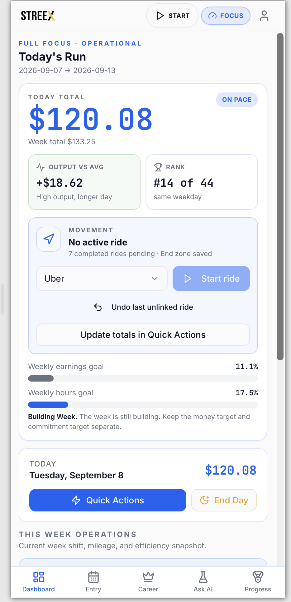
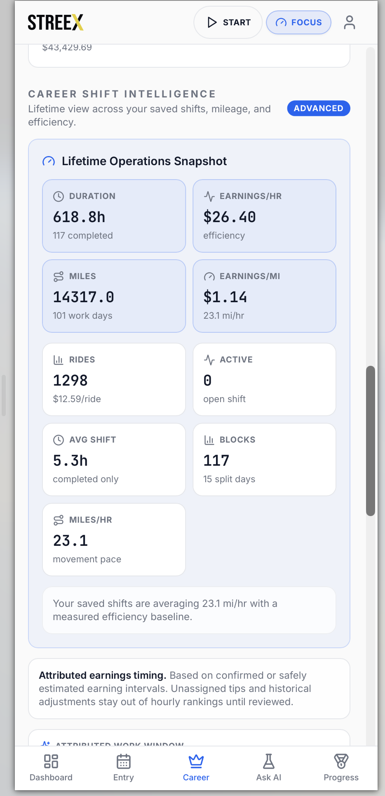
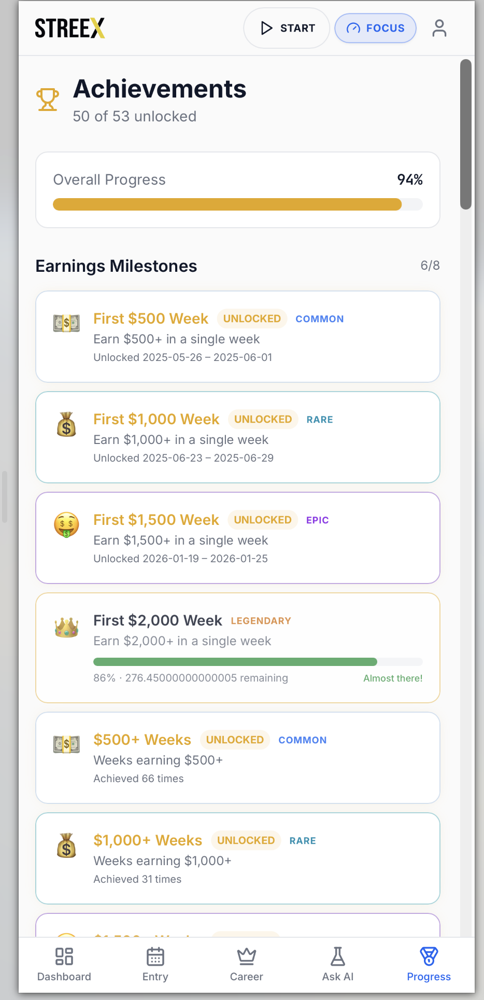
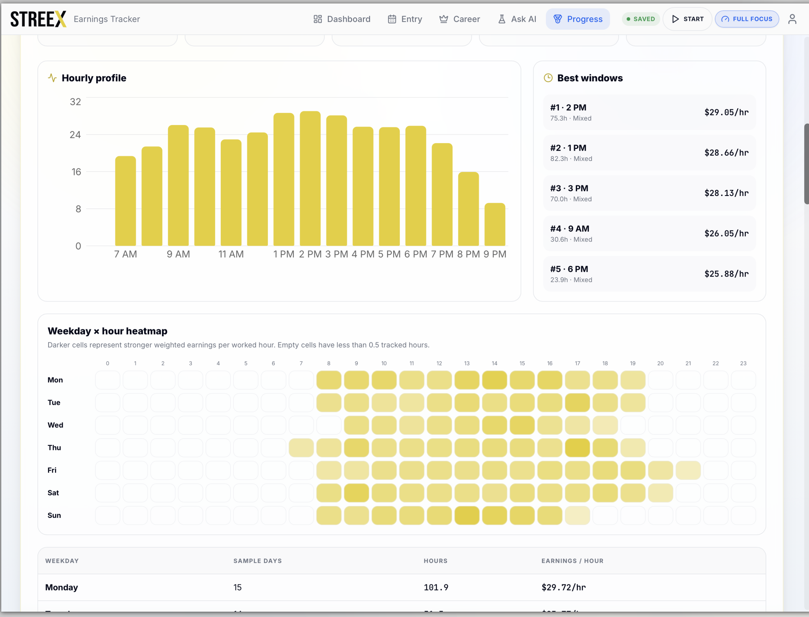
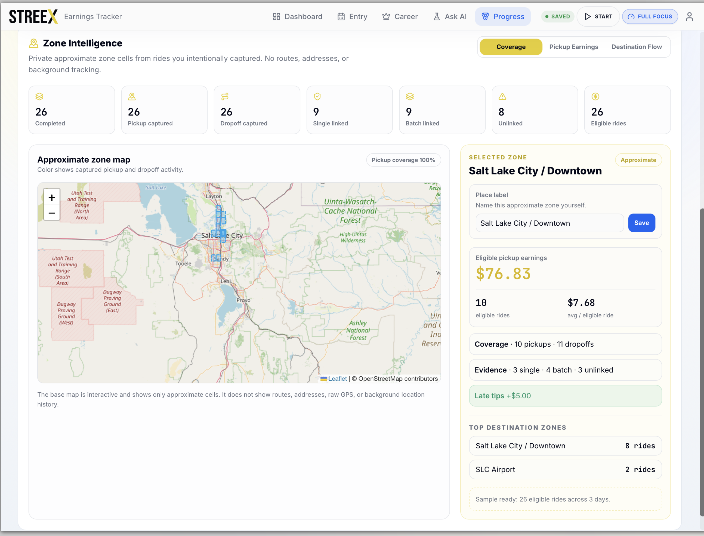

# STREEX

> **Gig earnings tracker. Career identity system. Personal performance cockpit.**

Streex is a mobile-first earnings and performance system for gig workers. It turns daily app totals, shifts, mileage, and rides into an honest record of how work is going — then turns that record into goals, comparisons, career identity, and evidence-based insights.

It is built around one idea:

> **My work has a story. My data belongs to me. My progress is real.**

## Product preview

The live product is available at [gig.getstreex.com](https://gig.getstreex.com). The production workspace requires an account because the app is designed around private, user-owned data.

<p align="center">
  
</p>

<p align="center">
  
  
  
</p>

<p align="center">
  
  
</p>

These are captured views of the product interface, showing the daily operating cockpit, **Deep Insights**, career-level shift intelligence, achievements, and approximate zone intelligence. The zone view intentionally communicates cells and coverage rather than routes, addresses, raw GPS, or background tracking.

## What problem does it solve?

Most earning trackers answer one question:

> How much did I make?

Streex also asks:

> What kind of driver am I becoming?

Gig work often spreads useful information across several provider apps, notes, spreadsheets, and memory. Streex brings that information into one personal operating system while keeping the analytics honest: the driver's own history is the benchmark, rest is not failure, and unsupported conclusions are not presented as facts.

## What I built

- **Daily operations:** earnings across multiple gig apps, shifts, mileage, rides, Quick Actions, weekly goals, and end-of-day recaps.
- **Integrity-aware analytics:** explicit earnings attribution, append-only observation snapshots, correction reconciliation, Data Health, and operational metrics that do not invent worked time.
- **Performance cockpit:** Dashboard, Compare, Deep Insights, Operational Explorer, hourly and weekday patterns, historical rankings, and driver playbooks.
- **Professional identity:** records, streaks, achievements, rarity tiers, XP, Driver Identity, archetypes, career titles, adaptive pace, and personal benchmarks.
- **Career narrative:** Journey, Weekly Letters, Monthly Recaps, heatmaps, milestones, and shareable progress moments.
- **Ownership and portability:** private user-scoped data, restore points, JSON backup, CSV export, historical import tooling, and recovery-oriented workflows.
- **Mobile-first product system:** responsive workflows, Full Focus modes, visual themes, installable PWA metadata, and calm/no-shame interaction patterns.

## Product philosophy

### Identity > Money

Income matters, but Streex is not only about totals. It helps drivers see discipline, momentum, recovery, standards, progress, and pride.

### No Shame Analytics

Days off are part of the gig lifestyle, not evidence of failure. The product is designed to support a real working life rather than pressure the user into permanent output.

### Your history is the benchmark

Streex compares the driver against their own past:

- best same weekday
- best week and month
- worked-day pace
- personal records
- ideal week built from their own history

The rival is not someone else. The rival is the driver's previous standard.

## Technical highlights

- **Domain-specific data integrity:** accumulated app totals are treated as deltas; mileage remains a day-level accumulated value; earnings observations stay separate from the time they were earned.
- **Honest operational metrics:** shift work blocks, pauses, explicit attribution choices, and correction reconciliation keep `$ / hour`, `$ / mile`, and `$ / ride` from being inflated by incomplete evidence.
- **Multi-surface analytics:** one canonical intelligence layer feeds Dashboard, Shift Intelligence, Deep Insights, Operational Explorer, Career, History, Daily Reports, and Driver Playbooks.
- **Privacy-aware movement context:** the current movement foundation uses foreground browser capture and coarse zones. Pickup and drop-off remain distinct, and the product does not claim reliable background GPS, raw routes, or precise location history.
- **Secure backend boundaries:** authenticated Supabase access, user-scoped RLS, server-side Edge Functions, no arbitrary SQL from the client, and no secrets in frontend code.
- **Performance-conscious delivery:** route-level lazy loading, on-demand Excel/image-export dependencies, focused production bundles, and a Vercel deployment with SPA route rewrites.
- **Quality gates:** GitHub Actions runs typecheck, lint, unit tests, production build, and public browser smoke tests. Authenticated route and cross-account RLS certification remain a separate QA gate.

## Implemented, in progress, and experimental

The repository deliberately distinguishes shipped product behavior from work that exists in source but still needs owner validation or publication.

| Status | Scope |
| --- | --- |
| **Published production baseline** | Dashboard, Entry and Quick Actions, earnings/shifts/mileage, earnings attribution integrity, Deep Insights and Operational Explorer, Compare, Career, Achievements, Journey, Letters, Recaps, exports, authentication, and RLS-scoped persistence. |
| **Implemented in `main`, pending owner QA or publication** | Movement and coarse zone context, Zone Intelligence, ride allocation review, historical import, snapshot correction safety, multi-shift ride integrity, and newer comparison/performance refinements. |
| **Experimental / paused** | Ask My Data remains in the repository with its UI, deterministic analytics paths, tests, and Edge Function source, but its generative provider dependency is currently paused. It should not be treated as production-ready AI. |

Current public release: **Beta 0.9.6 — Earnings Attribution Integrity**

Current local source candidate: **Beta 0.10.8 — Historical Snapshot Safety**

See [`docs/PRODUCT_STATUS.md`](docs/PRODUCT_STATUS.md), [`docs/ROADMAP.md`](docs/ROADMAP.md), and [`CHANGELOG.md`](CHANGELOG.md) for the detailed release state.

## Architecture and stack

```text
React + TypeScript + Vite
              ↓
Mobile-first product UI
              ↓
Supabase Auth + Postgres + Edge Functions
              ↓
RLS-scoped user data and analytics
              ↓
Vercel production deployment
```

| Layer | Technologies |
| --- | --- |
| UI | React, TypeScript, React Router, Tailwind CSS, shadcn/ui, Radix UI |
| Product analytics | TypeScript domain modules, Recharts, date-fns, local comparison and export tooling |
| Data and auth | Supabase Auth, Supabase Postgres, row-level security, Supabase Edge Functions |
| Integrations | OpenWeather and TomTom Traffic through server-side utility functions |
| Delivery | Vite, Vercel, Cloudflare DNS, installable PWA metadata |
| Quality | Vitest, Testing Library, Playwright, GitHub Actions |

## Main product surfaces

### Dashboard and Quick Actions

The main cockpit combines current-week earnings, goal progress, personal comparisons, records, momentum, Driver Identity, and active milestones. Quick Actions keeps live work practical with earnings updates, shift controls, mileage, rides, and clear save/sync states.

### Deep Insights

Deep Insights is a desktop-first analytics workspace with configurable periods, operational filters, weighted rates, evidence coverage, hourly profiles, weekday patterns, comparisons, rankings, and exportable Driver Playbooks.

### Driver Identity and career narrative

Achievements, XP, archetypes, career titles, Journey, Weekly Letters, Monthly Recaps, milestones, and share cards turn raw work history into a personal career narrative without turning the interface into a leaderboard against other people.

### History, recovery, and export

History supports editing, restore points, conflict-aware saves, historical context, JSON backup, and CSV export. The historical import path is preview-first and designed to preserve existing values rather than silently overwrite them.

### Movement and zone context

The movement foundation captures foreground ride context when available and reports whether start/end zones were captured, unavailable, or denied. Zone Intelligence uses approximate private cells, pickup/drop-off separation, evidence coverage, and confirmed labels rather than pretending that a daily total can reveal a past route.

## Privacy and safety principles

- User data is scoped through authentication and RLS.
- Raw coordinates, full routes, addresses, identity data, and third-party tracking are not treated as product analytics.
- Earnings observations are not automatically treated as proof of worked time.
- Unresolved timing or ride attribution remains visible as unresolved instead of being fabricated.
- Exports preserve user ownership and support backup or migration.
- No API keys, service-role keys, auth tokens, or production secrets belong in frontend code or public documentation.

## Live deployment

- **Production app:** [gig.getstreex.com](https://gig.getstreex.com)
- **Source repository:** [github.com/juangaudino/streex-gig](https://github.com/juangaudino/streex-gig)
- **Frontend hosting:** Vercel
- **Backend:** owner-controlled Supabase project
- **DNS:** Cloudflare

The live app is an authenticated workspace rather than a seeded public demo. Screenshots and portfolio walkthroughs should use a sanitized account or synthetic data.

## Local development and preview

This repository is configured for Vercel production and preview deployments.

### Requirements

- Node.js
- npm
- A configured Supabase project for local development

### Commands

```bash
npm install
npm run dev
```

Validation commands:

```bash
npm run typecheck
npm run lint
npm test
npm run build
```

The Vercel build uses:

- Framework preset: `Vite`
- Build command: `npm run build`
- Output directory: `dist`

Required public-shaped environment variables are documented by the app configuration:

```bash
VITE_SUPABASE_URL=
VITE_SUPABASE_PUBLISHABLE_KEY=
VITE_SUPABASE_PROJECT_ID=
```

Never place service-role credentials or provider secrets in the frontend environment.

## Documentation

The public README is the fast product and engineering overview. The detailed operational documentation remains available for contributors and maintainers:

- [`docs/PRODUCT_STATUS.md`](docs/PRODUCT_STATUS.md) — living release and capability status
- [`docs/ROADMAP.md`](docs/ROADMAP.md) — product roadmap and status labels
- [`docs/PROJECT_CONTEXT.md`](docs/PROJECT_CONTEXT.md) — durable architecture and product context
- [`docs/QA_RUNBOOK.md`](docs/QA_RUNBOOK.md) — release and QA procedures
- [`docs/NEW_CHAT_HANDOFF.md`](docs/NEW_CHAT_HANDOFF.md) — contributor handoff and current risks
- [`docs/STREEX_AI_WORKFLOW.md`](docs/STREEX_AI_WORKFLOW.md) — AI-assisted development workflow
- [`CHANGELOG.md`](CHANGELOG.md) — detailed release history

## The big idea

Streex is not just tracking gig earnings.

It is building a personal operating system for independent work:

- track the money
- understand the rhythm
- protect the recovery
- celebrate the progress
- own the data
- grow the identity

**Built for drivers who want their work to feel like progress, not just transactions.**
